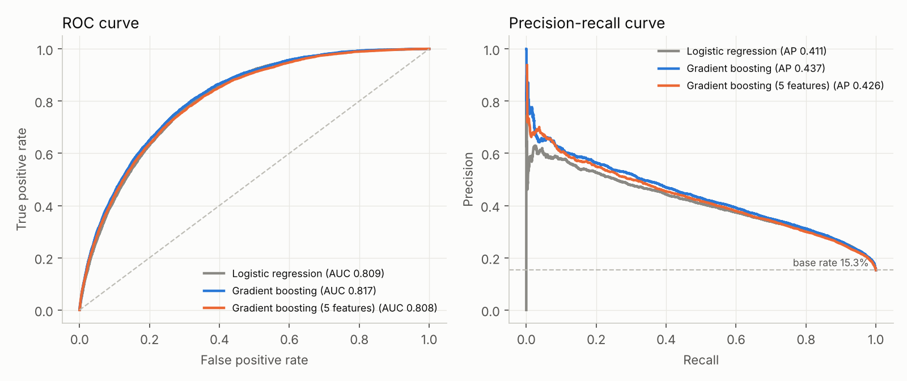
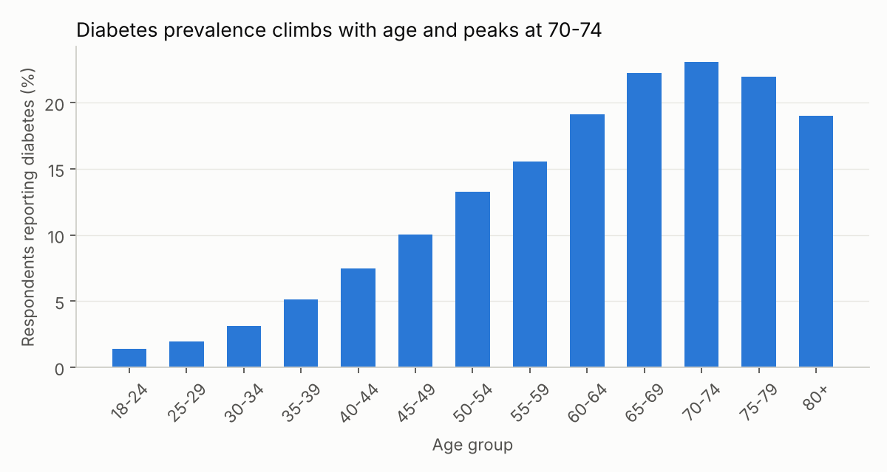
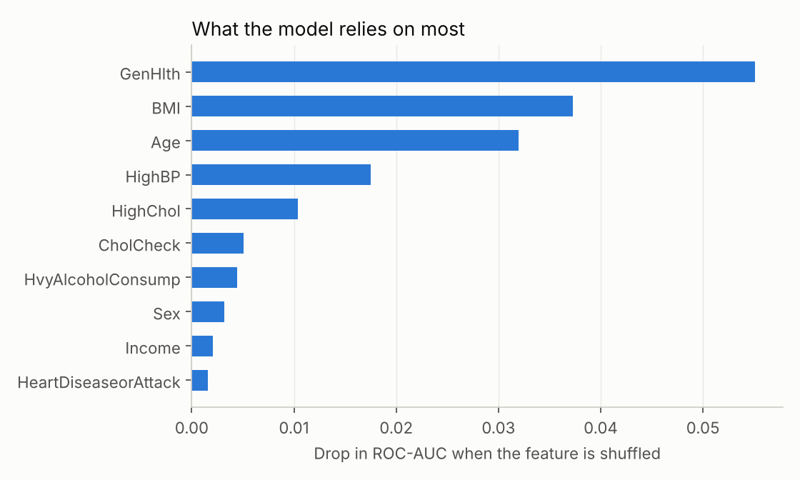

# Diabetes Risk Screening from Survey Data

A machine learning model that flags people likely to have diabetes using self-reported health and lifestyle answers, built on the CDC BRFSS 2015 survey (253,680 respondents, 21 indicators).

The question behind it: **how well can a short, cheap questionnaire work as a first-pass screen, before any blood test?** This matters for continuous-care and preventative health products, where the goal is deciding who needs a lab test first.

## Results

Held-out test set: 45,957 respondents (15.3% report diabetes).

| Model | Features | ROC-AUC | PR-AUC |
|---|---|---|---|
| Logistic regression | 21 | 0.809 | 0.411 |
| Gradient boosting | 21 | **0.817** | **0.437** |
| Gradient boosting | 5 (Age, BMI, HighBP, HighChol, GenHlth) | 0.808 | 0.426 |

**Screening operating point.** The decision threshold is tuned on a separate validation set to catch about 80% of true diabetes cases. On the test set, the full gradient boosting model then:

- catches 79.7% of people with diabetes (recall)
- is correct for 31.3% of the people it flags (precision), about twice the 15.3% base rate
- correctly clears 68.4% of people without diabetes (specificity)
- flags about 39% of everyone screened

**Takeaways**

- A **5-question screen performs almost as well as all 21 features** (ROC-AUC 0.808 vs 0.817). Most of the signal is in age, BMI, blood pressure, cholesterol, and general self-rated health.
- Gradient boosting beats logistic regression only slightly, so the signal is mostly additive and a simple, explainable model is a reasonable choice.
- This is a **triage tool, not a diagnosis**. At 80% recall, roughly two out of three flagged people do not report diabetes, which is acceptable only if the follow-up step (such as a blood test) is cheap.





## Method

1. **Target.** Diabetes (BRFSS class 2) versus everyone else. Pre-diabetes (class 1, under 2% of respondents) is counted as not diabetic, because the class is too small and noisy to model well on its own.
2. **Deduplication.** 23,899 exact duplicate rows were removed (253,680 to 229,781) before splitting. Duplicates left in would appear in both train and test sets and inflate scores.
3. **Split.** Stratified 60/20/20 train, validation, and test, fixed seed 42. The decision threshold is chosen on validation only; the test set is used once for reporting.
4. **Imbalance.** Only 15% of rows are positive, so both models use balanced class weights, and the models are compared on PR-AUC as well as ROC-AUC.
5. **Interpretation.** Permutation importance on the test set: the drop in ROC-AUC when a feature is shuffled. Top features: general health, BMI, age, high blood pressure, high cholesterol.

## Limitations

- **Self-reported US survey data from 2015.** The labels are self-reported diagnoses, not lab values, and the population is American. The model should not be assumed to transfer to Indian populations, where body composition and risk profiles differ. Validating on Indian data would be the next step.
- **Association, not causation.** Feature importance shows what predicts the label, not what causes diabetes.
- **Probabilities are not calibrated.** Class weighting shifts predicted probabilities upward, so use them for ranking and thresholding, not as literal risk percentages.
- **No external validation.** Everything here comes from one survey year, split randomly.

## Run it

```bash
pip install -r requirements.txt
# Download the dataset from Kaggle: "Diabetes Health Indicators Dataset"
# (file: diabetes_012_health_indicators_BRFSS2015.csv) and place it in data/
python train.py
```

Outputs are written to `results/metrics.json` and `figures/`. Runtime is under a minute.

## Repo layout

```
train.py            # data cleaning, model comparison, plots
requirements.txt
results/metrics.json
figures/            # charts used above
data/               # place the CSV here (not committed)
```

**Data source:** CDC Behavioral Risk Factor Surveillance System (BRFSS) 2015, as packaged in the Kaggle "Diabetes Health Indicators Dataset".
